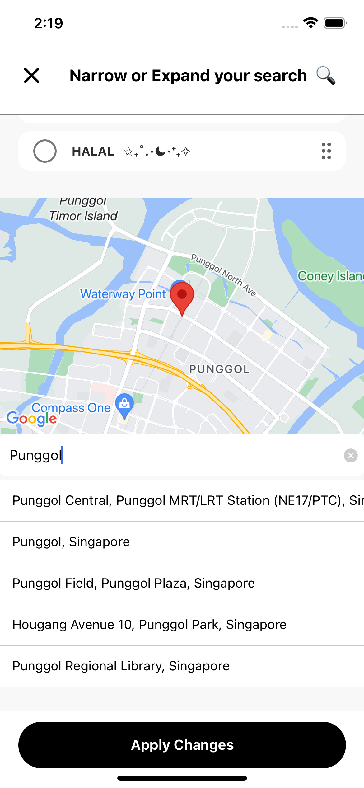

# FoodFetch

#### FoodFetch is your go-to mobile app for exploring nearby restaurants, food courts, and cafes using an engaging card-swiping interface. Say goodbye to the daily struggle of choosing what to eat and break free from culinary monotony.

***

### Discover Nearby Restaurants
#### Explore a diverse selection of restaurants in your vicinity and discover their location on google maps 

  
&nbsp; &nbsp; &nbsp; &nbsp;
     
&nbsp; &nbsp; &nbsp; &nbsp;

  
   

#### Swipe Right to Save - Indicate interest by swiping right, saving cards for future reference

  
&nbsp; &nbsp; &nbsp; &nbsp;
         

***

### Filter by Distance and Cuisine
#### Refine your search based on preferred cusine as well as distance to your current location

***

### Explore Beyond Your Location
#### Easily switch locations to discover culinary delights in different areas around Singapore and even internationally

  
&nbsp; &nbsp; &nbsp; &nbsp;
         

